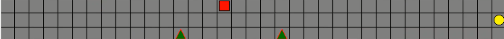

# Optimization Of Self-driving Car Based On Velocity Adjustment in RL

## Overview
Self driving cars are quite popular these days and a higher level of automation in terms of driving has the potential to reduce dangerous drivers ​behaviors, which may improve road safety and pedestrian safety. Therefore, we think it would be an important and interesting topic to do research on. Our setup is: the agent is driving on a straight road, while several ​pedestrians are standing on the pavement and there are multiple traffic signs and traffic lights along the way. Our goal is to train the agent such that it slows down when approaching the pedestrians and follows all the traffic rules. In addition, our agent still has a certain velocity when it reaches the destination.

Reinforcement learning is considered a powerful AI paradigm that can teach machines by interacting with the environment and learning from mistakes. Despite its practicality, it has not been successfully used in automotive applications. Inspired by Google DeepMind's successful demonstration of Atari games and Go learning, we proposed a framework for using reinforcement learning for autonomous driving. This is particularly relevant because it is difficult to treat autonomous driving as a supervised learning problem due to the strong interaction with the environment (including other vehicles, pedestrians, and road works). Therefore, we will focus on whether we can use some algorithms of reinforcement learning to better realize the reasonable planning of the speed when the autonomous car interacts with some environments or people.
 
 

## Scenarios
- The self-driving vehicle is driving on a straight road, but there are 2 pedestrians standing on the pavement near the driving road, the vehicle should slow the velocity when passing by these 2 people.
- The self-driving vehicle should arrive at the termination of the road as fast as possible in the condition of safely passing by pedestrians.
- The self-driving vehicle needs to pass the end point at a prescribed speed

 
 

## Environment definition:
We use Tkinter to build a simple car driving environment. The entire environment is a 3*35 gray grid, where the first row represents the road where the car is driving, and a square that changes color as the speed changes is used to represent the vehicle, and the vehicle travels from left to right. The speed of the vehicle is represented by moving several squares at a time. For example, when the speed is 2, the vehicle will move two squares to the right in the next step. The initial speed is 3, the faster the vehicle speed, the darker its color. The vehicle has 5 actions [maintain speed, speed +1, speed +2, speed -1, speed -2];

A yellow circle in the second row indicates the end point, and the car passes the end point at the specified speed is a task to complete (which is 4);

There are two red-edged green triangles in the third row, representing two pedestrians. The second task completion is the car not overspeeding past the pedestrian (the maximum speed of the car passing the pedestrian is 2). The two pedestrians randomly change their positions during each experiment to increase the complexity of the environment.

About reward setting:
- Effectiveness:
  - When the car passes the end point at the specified speed, the reward is increased by 60; otherwise, the reward is increased by -60.
   Each step of the car will increase the reward of -4.
   When the car speed is lower than the minimum speed (0), the reward of -16 is increased.

- Traffic rules:
  - When the car has an overspeeding (speed greater than 4) during the entire journey, the reward of -12 is added.

- Safety:
  - When the car is speeding past pedestrians (speed exceeds 2), the reward of -60 is increased.

- Comfort:
  - When the car speed is negative, the reward of -20 is increased. Every time the car changes its behavior, the reward is increased by 
  

 
 
 

### Visualization
> Visualization 

 

- The grey grid: Roads and Pavements
- The square: The vehicle/agent
- Different colors of square: Different velocities of the vehicle/agent
- Yellow circle: The destination of the road
- Green triangle: Pedestrians

 
 

### File Description
- self-driving.ipynb: 
  The notebook contains all codes and comments
- report.pdf: 
  The report of the project, including detailed introduction, description and algorithm and their results' analysis
- output: 
  The folder contains output files for each method (like result-plot.png and q-table.pkl)
- requirements.txt: 
  The dependent libraries
- viz.png: 
  One example visualization screenshot of the agent/vehicle learning outcome

 
 

### Dependencies
With Python 3
- [json](https://docs.python.org/3/library/json.html)
- [numpy](http://www.numpy.org/)
- [matplotlib](https://matplotlib.org/)
- [pandas](https://pandas.pydata.org/)
- [pickle](https://docs.python.org/3/library/pickle.html) - to save the table in .pkl file
- [tkinter](https://docs.python.org/3/library/tk.html) - to generator the visualization/animation
- [tensorflow](https://www.tensorflow.org/) - DQN
- [random](https://docs.python.org/3/library/random.html)
- [time](https://docs.python.org/3/library/time.html)

 
 

## Algorithms
In this project, we tried several types of algorithms for agent learning,
- Monte-Carlo Algorithm 
- Q-learning Algorithm
- SARSA Algorithm
- SARS-Lambda Algorithm
- Dynamic Programming Method
- Deep Q-learning Algorithm

**See more details about algorithm introduction and implementation, and their results in the report file**

 
 

## Future Works

In general, most of the algorithms have good performance in this simple car speed control environment, they all have amazing learning speed and good learning results. In the next step, we can build more complex and diverse environments to evaluate the performance and learning of different algorithms. At the same time, how to better adjust the parameters and structure of DQL to have better learning results is also the goal that we need to further experiment and explore.

 
 

## References
* https://mofanpy.com/tutorials/machine-learning/reinforcement-learning
* https://towardsdatascience.com/reinforcement-learning-demystified-solving-mdps-with-dynamic-programming-b52c8093c919
* http://www.incompleteideas.net/book/RLbook2020.pdf 
* https://arxiv.org/pdf/1704.02532.pdf 
* https://ieeexplore.ieee.org/abstract/document/8248668 
* https://github.com/openai/gym 
* https://towardsdatascience.com/reinforcement-learning-dynamic-programming-2b89da6ea1b

 
 

## Authors
Cao Bo
, Haoyu Yin
, Qianjin Wu
, Yixuan Wang
